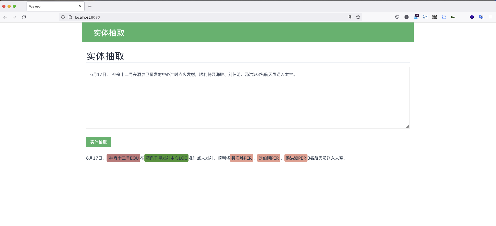

### 简介

这是一个简单的实体抽取项目，里面涉及了人物，地点，组织机构，武器装备等命名实体抽取。

### 后端启动方式

    cd backend
    virtualenv venv
    source venv/bin/activate
    pip install -r requirements.txt

启动好虚拟环境及安装依赖后，直接
    
    python3 api.py

便可。

### 前端启动方式

   cd frontend
   yarn install
   yarn run serve

启动完成后，打开浏览器， 输入http://localhost:8080 便可访问。

页面效果如下：

### 说明

如果报包依赖，按照错误提示进行相应安装便可。